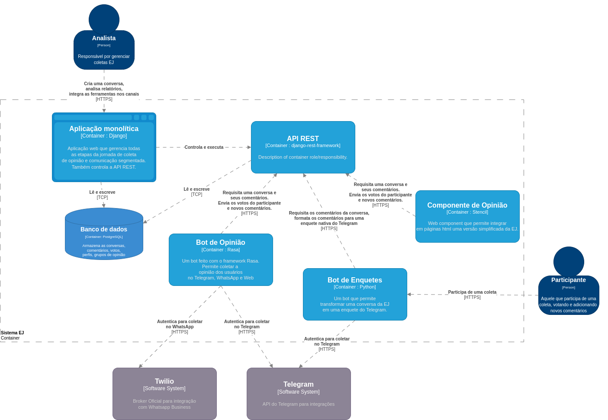

========================
Arquitetura de Software
========================

.. contents::
   :depth: 2

Visão geral
===================

A EJ é uma plataforma de pesquisa de opinião multicanal e comunicação digital segmentada.
É desenvolvida utilizando o Framework `Django <https://www.djangoproject.com/>`_ e disponibiliza parte de seus recursos por meio de
uma `API REST <https://restfulapi.net/>`_. Algumas das suas principais funcionalidadades: 

1. Permite a criação de pesquisas por meio de conversas temáticas.
2. Permite que usuários participem de uma conversa votando em comentários, que representam diferentes opiniões sobre o tema pesquisado.
3. Permite agrupar os participantes em grupos (clusters), a partir da forma como eles votam nos comentários.
4. Permite a modelagem de personas para viabilizar o agrupamento por opinião.
5. Permite acompanhar o resultado de uma conversa por meio de diferentes relatórios.
6. Permite integrar uma conversa em diferentes canais como: Telegram, Whatsapp, lista de email e páginas html.

A EJ utiliza uma arquitetura monolítica em que todo o processo de criação, modelagem e acompanhamento
das conversas é realizado. Junto da aplicação web também é executada uma API REST, 
utilizada pelas ferramentas de coleta. 
Uma ferramenta de coleta é uma aplicação que se integra na EJ para levar os recursos de
participação para outros canais, como Telegram e Whatsapp.

Ecossistema
============

O Ecossistema EJ é o conjunto de repositórios e ferramentas que utilizamos para viabilizar a coleta
de opinião multicanal. Listaremos aqui os respositórios e uma breve descrição para cada um.

EJ Application
---------------

    **Repositório**: https://gitlab.com/pencillabs/ej/ej-application

    Aplicação WEB, onde se encontra esta documentação.

Componente de Opinião
----------------------

    **Repositório**: https://gitlab.com/pencillabs/ej/conversation-component

    *Web Component* que permite integrar a jornada de participação da EJ em páginas html.
    A motivação desse projeto é viabilizar a participação nas conversas sem que o usuário precise
    ser redirecionado para outro ambiente.

Bot de Opinião
---------------

    **Repositório**: https://gitlab.com/pencillabs/ej/ej-bot

    Permite relizar coletas EJ via interface conversacional. Pode ser integrado no Telegram, Whatsapp
    ou página html. O bot é implementado utilizando o Framework Rasa.

Bot de Enquetes
----------------

    **Repositório**: https://gitlab.com/pencillabs/ej/ej-telegram-groups-bot

    Permite relizar coletas EJ no formato de enquetes do Telegram. O bot é implementando utilizando
    a SDK Python do Telegram.

Blog
------

    **Repositório**: https://gitlab.com/pencillabs/ej/blog

    Aplicação feita com `Wagtail <https://wagtail.org/>`_ para gerenciar as publicações do ecossistema
    EJ.

Django
=======

MVT
----

A arquitetura padrão do Django é o MVT https://djangobook.com/mdj2-django-structure/, aonde temos as models controlando regras de negócio, as views controlando o fluxo da aplicação e os templates, que são a camada de apresentação e interação com o usuário.  Por ser uma aplicação monolítica, tudo é processado do lado do servidor e entregue para o cliente (browser).

Django divide um sistema Web em módulos chamados "apps" que implementam modelos
de banco de dados reutilizáveis, rotas e funcionalidades.

Frontend
--------

O frontend do EJ é implementado usando a linguagem de modelagem Jinja2 e usa
aprimoramento progressivo para incluir estilos via CSS e comportamentos
personalizados com JavaScript. A seguir apresenta uma breve visão geral
das tecnologias utilizadas em cada uma dessas camadas:

CSS
    O estilo da EJ é implementado utilizando SASS e seguindo o padrão `BEM <http://getbem.com/introduction/>`_.
    A compilação sass->css requer libsass, que é empacotado nas dependências do Python do aplicativo.
    Existe um comando para a compilação: ``inv sass --watch``.

JavaScript/TypeScript
    EJ não adota qualquer estrutura JavaScript tradicional, mas em vez disso,
    depende de aprimoramento progressivo para adicionar funcionalidades opcionais.
    EJ usa Unpoly_ em conjunto com jQuery_ para fornecer a funcionalidade principal.
    Os componentes específicos do EJ são criados usando o TypeScript e aprimoram
    as marcas anotadas com o atributo "is-Component" com comportamentos e
    funcionalidades extras. A compilação do TypeScript requer o node Package
    Manager (NPM) e o Parcel_.

    Localização: */lib/js/*

.. _Mendeleev.css: https://www.npmjs.com/package/mendeleev.css
.. _Unpoly: https://unpoly.com
.. _jQuery: https://jquery.com
.. _Parcel: https://parceljs.org

Aplicativos
-----------

``ej_conversations``

    Aplicativo responsável por gerenciar a criação e gestão de uma conversa, comentários e votos.
    
``ej_users``

    Aplicativo responsável por gerenciar a criação e gestão dos usuários, incluíndo o processo de
    autenticação, recuperação de senha, login e logout.

``ej_profiles``

    Aplicativo responsável por gerenciar o perfil do usuário. O `ej_users` controla informações básicas relacionadas à autenticação enquanto o `ej_profiles` gerencia informações pessoais, como raça, gênero, número de telefone e imagem de perfil.

``ej_clusters``

    Aplicativo responsável por gerenciar as rotinas matemáticas de clusterização e classificação dos
    participantes. O módulo `ej_clusters.math`  implementa o nosso algorítmo K-means modificado,
    que permite agrupar usuários de acordo com a definição de personas.

``ej_dataviz``

    Aplicativo responsável pela visualização dos resultados de uma coleta, como a visualização de núvem de pontos, relatório de comentários, relatório de participantes, dashboard da conversa e grupos de opinião.

``ej_boards``

    Aplicativo responsável por agrupar as conversas do perfil Analista.

``ej_tools``

    Aplicativo responsável por gerenciar as ferramentas de coleta e integrações da EJ com outras plataformas.

``ej_signatures``

    Aplicativo responsável por gerenciar os modelos de assinatura da plataforma, além de restringir 
    o uso de alguns recursos dependendo do usuário que está logado.

Módulos
--------

O módulo EJ não é propriamente um aplicativo, mas um pacote Python regular usado
para coordenar aplicativos definindo configurações, funcionalidade comum e
carregando ativos estáticos como JavaScript, CSS, imagens, temas etc. A seguir
temos uma visão geral dos principais subpacotes e módulos:

``ej.components``
    Da mesma forma que o ``ej.roles``, este módulo define renderizadores para
    elementos de interface do usuário reutilizáveis. A diferença entre os dois
    módulos é que os componentes podem ter uma estrutura mais complicada e
    podem não estar diretamente associados a algum tipo de dados Python conhecido.

``ej.contrib``
    Local para incluir migrações ad-hoc para implantações específicas. A maioria
    dos usuários e desenvolvedores nunca deve tocar isso.

``ej.fixes``
    Monkey patch módulos de terceira parte que têm problemas conhecidos com EJ ou qualquer uma de suas dependências.

``ej.components``
    Da mesma forma que ``ej.roles``, este módulo define renderizadores para elementos reutilizáveis da IU.
    A diferença entre os dois módulos é que os componentes podem ter uma estrutura mais complicada
    e podem não estar diretamente associados a algum tipo de dados Python conhecido.

``ej.contrib``
    Local para incluir migrações ad-hoc para implantações específicas. 
    A maioria dos usuários e desenvolvedores *nunca* deve tocar nisso.

``ej.fixes``
    Monkey patch de módulos de terceiros que tem problemas conhecidos com a EJ
    ou com suas dependências.

``ej.forms``
    Classes de formulário base que são usadas em outros aplicativos EJ.
    Os formulários são derivados de django.forms.

``ej.jinja2``
    EJ usa Jinja2 como a linguagem de modelagem padrão.
    Este módulo configura o ambiente Jinja2 e define funções e filtros globais.

``ej.roles``
    Funções que definem as `roles` do Hyperpython. Roles são mapeamentos
    ``(type, name) -> HTML`` que definem como um certo objeto deve ser definido
    dado um contexto ou um role. Esse módulo define vários elementos de IU
    reutilizáveis como funções Python.

``ej.routes``
    Define algumas funções de visualização global, como a página inicial, que não possui funcionalidade vinculada a nenhum aplicativo.

``ej.services``
    Funções auxiliares para inicializar conexões com serviços externos, como
    Banco de dados Postgres SQL e redis (se habilitado).

``ej.settings``
    Módulo de configurações do Django. 
    Define a configuração usando a estrutura de configuração do Django Boogie, 
    na qual a configuração é definida em classes reutilizáveis em vez de um módulo Python simples.

``ej/templates/jinja2``
    Contém templates globais. O template global ``base.jinja2``
    define a estrutura base de HTML (navigation bars, meta information, etc)
    que é compartilha na maioria das páginas do website.

``ej.testing``
    Ferramentas auxiliares usadas em testes.

``ej.tests``
    Testes globais. A maioria dos testes são implementados nas pastas dos apps.

``ej.urls``
    Mapeamento de URLs para o projeto. A maioria das URLs são incluídas no próprio 
    `` routes.py`` do aplicativo.

``ej.utils``
   Módulo de funções de utilidades.

``ej.wsgi``
    Wrapper Django para a interface WSGI.
