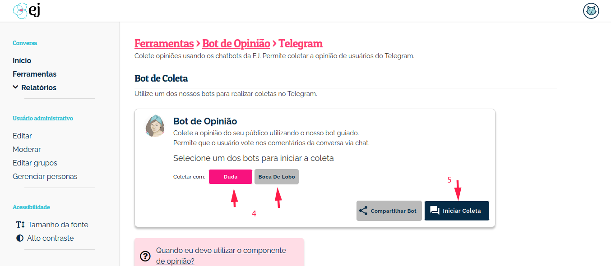

##############################
Duda: O chatbot oficial da EJ
##############################

Para iniciar a configuração do chatbot, primeiramente é necessário
ter uma instância do Rasa_ rodando. O Rasa é plataforma de inteligência artificial 
utilizada para construir a personalidade do chatbot, e para integrá-lo
a API da EJ. Para instruções técnicas de como rodar o chatbot da EJ em
um ambiente de homologação, acesse https://gitlab.com/pencillabs/ej/ej-bot.

Telegram
==========================================

Como faço para localizar o bot no Telegram?
-------------------------------------------

Para começar a interagir com a Duda a partir do Telegram, clique no campo de busca do Telegram e digite DudaEjBot ou se preferir acesse http://t.me/dudaejbot

* O bot está denominado como Duda - Empurrando Juntas.

Como gerar um link de participação?
-----------------------------------

Para fazer a coleta de opinião é necessário gerar um link de participação que será enviado para grupos, canais ou pessoas específicas. A geração do 
link é feita na Plataforma EJ pelo administrador da conversa.  Ao clicar no link gerado, o usuário do Telegram é direcionado para o bot, e inicia
sua participação na coleta. Para gerar o link de participação, execute os seguintes passos:

1. Como administrador, selecione uma conversa para realizar a coleta de opinião e, dentro do menu lateral dessa conversa, vá até a seção **Ferramentas**.

2. Depois, entre na seção **Bot de Opinião**.

3. Selecione a plataforma **Telegram**.

4. Escolha qual dos bots disponíveis será utilizado para fazer a coleta. Basta selecionar um dos botões.

5. Copie o texto e o link de participação clicando no botão **Compartilhar Bot**, conforme mostra a figura. 

O link gerado fica no seguinte formato de exemplo: *http://t.me/DudaEjBot?start=<ID da conversa>*.

.. figure:: ../images/ferramenta-chatbot_12.png 
.. figure:: ../images/ferramenta-chatbot_3.png
.. figure:: ../images/ferramenta-chatbot_41.png 

Como iniciar uma conversa com a Duda?
-------------------------------------

Repita os passos de 1 à 4 do item anterior *Como gerar um link de participação?*

5. Para iniciar a conversa diretamente no bot, selecione o botão **Iniciar Coleta**.

.. figure:: ../images/coleta-telegram.png 
  :align: center

Whatsapp
==========================================

Como gerar um link de participação?
-----------------------------------

Para fazer a coleta de opinião é necessário gerar um link de participação que será enviado para grupos ou pessoas específicas. A geração do 
link é feita na Plataforma EJ pelo administrador da conversa.  Ao clicar no link gerado, o usuário do Whatsapp é direcionado para o bot, e inicia
sua participação na coleta. Para gerar o link de participação, execute os seguintes passos:

1. Como administrador, selecione uma conversa para realizar a coleta de opinião e, dentro do menu lateral dessa conversa, vá até a seção **Ferramentas**.

2. Depois, entre na seção **Bot de Opinião**.

3. Selecione a plataforma **Whatsapp**.

4. Escolha qual dos bots disponíveis será utilizado para fazer a coleta. Basta selecionar um dos botões.

5. Copie o texto e o link de participação clicando no botão **Compartilhar Bot**, conforme mostra a figura.

.. figure:: ../images/ferramenta-chatbot_12.png 
.. figure:: ../images/ferramenta-chatbot-wpp_3.png
.. figure:: ../images/ferramenta-chatbot-wpp_41.png 

O link gerado fica no seguinte formato de exemplo: *https://api.whatsapp.com/send?phone=<Número de telefone>&text=start+<ID da conversa>*.

Como iniciar uma conversa com a Duda no *Whatsapp*?
-----------------------------------------------------

Repita os passos de 1 à 4 do item anterior *Como gerar um link de participação?*

5. Para iniciar a conversa diretamente no bot, selecione o botão **Iniciar Coleta**.

A Duda precisa que o usuário envie a mensagem *start <ID da conversa>* para poder iniciar a conversa. 

.. figure:: ../images/ferramenta-chatbot-wpp_42.png 
.. figure:: ../images/coleta-whatsapp.png
  :align: center 

Webchat
==========================================

Para fazer coletas de opinião via chatbot, o administrador da conversa pode configurar em sites e blogs o projeto rasa-webchat_. Este projeto criar um chat web na página html em que ele for incluído, permitindo que usuários que cheguem à pagina participem de uma coleta. O seguinte *snippet* pode ser utilizado para integrar o webchat à Duda.

.. code-block:: html

  <html>
    <head></head>
    <body></body>
    
  </html>

Uma vez configurado o script na página, o administrador precisa registrar na EJ a URL em que o webchat está integrado. Dessa forma, o bot saberá qual conversa da EJ ele deve apresentar para o visitante. Para realizar esse registro, basta acessar a área de ferramentas da conversa, selecionar a ferramenta `Rasa Webchat`, e cadastrar a URL em que o script foi configurado. Feito isso, o webchat irá apresentar para os visitantes a conversa integrada.

.. figure:: ../images/ej-docs-webchat.png 

Rocket.chat
==========================================

Caso você queira integrar a Duda à uma instância do Rocket.chat, siga os passos a seguir.

1. Crie no Rocket.chat um usuário com as mesmas credenciais presentes no arquivo `bot/credentials.yml`, no respositório do ejBot;

  * Esse usuário deve ter o papel `bot`, atrelado a sua conta;
  * No `bot/credentials.yml` deve haver uma configuração apontanto para a instância do Rocket.chat;

2. Crie um novo canal, e adicione o usuário bot como participante;

3. Ainda no Rocket, Vá em Administração -> Integrações, e crie uma nova integração de saída (*Outgoing*);

  * No campo url, informe a url da instância do Rasa, por exemplo: https://rasaserver.pencillabs.com.br/webhooks/rocketchat/webhook
  * Preencha os outros campos, de acordo com o nome do canal que foi criado e o nome do usuário bot;

Se tudo foi feito corretamente, agora basta mandar uma mensagem no canal, que a Duda irá responder.

.. figure:: ../images/ej-rasa-rocket.png 

.. _Rasa: https://rasa.com/ 
.. _rasa-webchat: https://github.com/botfront/rasa-webchat

Livechat
---------

Para utilizar o bot no modo livechat do rocketchat é necessário fazer algumas configurações.

1. Em Ominichannel > Gatilhos de Livechat, crie um novo gatilho:

  * Ative as opções Ativo e Rodar apenas uma vez por visitante;
  * Condition: Tempo de visitante no site;
  * Action - Envie uma mensagem: Escolha a opção "Agente personalizado". Logo abaixo digite o nome do agente do bot no rocketchat. Por fim coloque a mensagem de ` welcome` do bot. Depois clique em salvar.

.. figure:: ../images/ej-rasa-exemplo-gatilho.png

2. Em Webhooks, caso não configurado, configure da seguinte forma:

  * URL do webhook: https://rasaserver.pencillabs.com.br/webhooks/rocketchat/webhook;
  * Token secreto: Insira o token de acesso;
  * Send Request on: Selecione Visitor Messages. Depois clique em salvar.

.. figure:: ../images/ej-rasa-webhook.png

3. Para testar basta ir em Instalação do Livechat copiar o codigo no seu website.

.. figure:: ../images/ej-rasa-livechat-install.png

Como obter mais informações sobre o ambiente de desenvolvimento?
====================================================================================
Para saber mais detalhes sobre o ambiente de desenvolvimento, basta acessar o `repositório de implementação do bot <https://gitlab.com/pencillabs/ej/ej-bot#ej-bot>`_.

