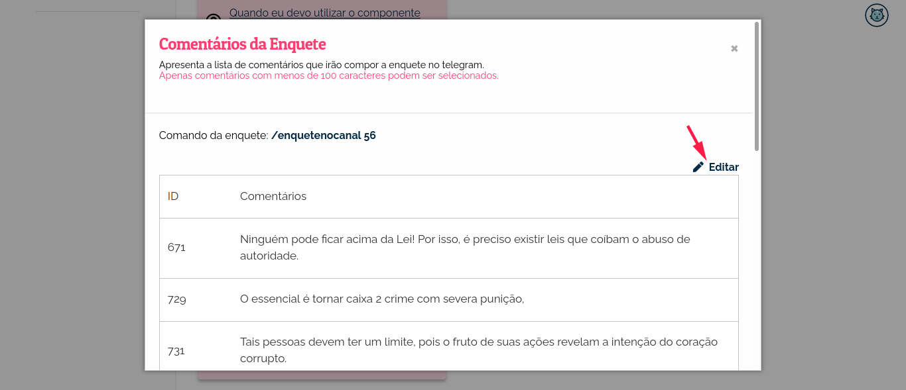

#######################################################
EjGroupsBot: O chatbot oficial do bot de enquetes da EJ
#######################################################

O EjGroupsBot é um bot de enquetes que tem como objetivo realizar coletas sem que 
os participantes precisem ser encaminhados para o privado. Na enquete criada, cada pergunta 
é um comentário da EJ e o tema da enquete é o título da conversa.

Telegram
==========================================

Como faço para localizar o bot no Telegram?
-------------------------------------------

Para localizar o EjGroupsBot no Telegram, clique no campo de busca do Telegram e digite 
EjGroupsBot ou se preferir acesse https://t.me/ejgroupsbot

* O bot está denominado como Enquete Boca de Lobo.

Como configurar e interagir com o bot de enquetes?
--------------------------------------------------

O Bot de Enquetes possui dois modos de operação: *Canal* e *Grupo*.

Para realizar uma coleta através de um Canal, execute os seguintes passos:

1. Encontre o bot @EjGroupsBot no Telegram;

2. Escreva o comando **/enquetenocanal <ID da conversa>**. O comando vai buscar os 10 primeiros comentários que não tenham mais que 100 caracteres da conversa <ID da conversa> para montar a enquete;
  * Também é possível passar uma lista de comentários para o comando. Para isso escreva o comando **/enquetenocanal <ID da conversa> id_comentario id_comentario id_comentario**. É possível passar de 2 à 10 comentários para a enquete;

3. Encaminhe a enquete gerada para o canal desejado;

Para realizar uma coleta através de um Grupo, execute os seguintes passos:

1. Encontre o bot @EjGroupsBot no Telegram;

2. Adicione o Bot no seu grupo;

3. Escreva o comando **/enquetenogrupo <ID da conversa>**. Esse comando também vai buscar os 10 primeiros comentários. 
  * Também é possível passar uma lista de comentários. Para isso escreva o comando **/enquetenogrupo <ID da conversa> id_comentario id_comentario id_comentario**. É possível passar de 2 à 10 comentários para a enquete;

É possível configurar os comandos **enquetenogrupo** e **enquetenocanal** de forma facilitada na EJ, selecione a sua conversa e através de **Ferramentas > Chatbot > Telegram**. Agora basta selecionar entre canal e grupo nos botões e o comando a ser utilizado é atualizado no cartão.

.. figure:: ../images/bot-de-enquetes_0.png 

Para selecionar os comentários que vão compor a enquete, depois de selecionar entre **canal** e **grupo** clique no botão **Editar enquete**.  

.. figure:: ../images/bot-de-enquetes_1.png 

Uma janela com todos os comentários válidos da conversa vai aparecer. Clique em **Editar** para poder selecionar os comentários. 

Defina os comentários clicando na **caixa** do lado esquerdo do *ID* do comentário. Ao clicar o comando de geração da enquete é atualizado na parte superior do cartão. 

.. figure:: ../images/bot-de-enquetes_3.png 

Limitações
----------

A API do Telegram impõe algumas limitações:

1. Comentários com mais de 100 caracteres não são apresentados na enquete;
2. Cada enquete pode ter entre 2 e 10 comentários para voto;

Como obter mais informações sobre o ambiente de desenvolvimento?
----------------------------------------------------------------

Para saber mais detalhes sobre o ambiente de desenvolvimento, basta acessar o `repositório de implementação do bot de enquetes <https://gitlab.com/pencillabs/ej/ej-telegram-groups-bot#ej-telegram-groups-bot>`_.
