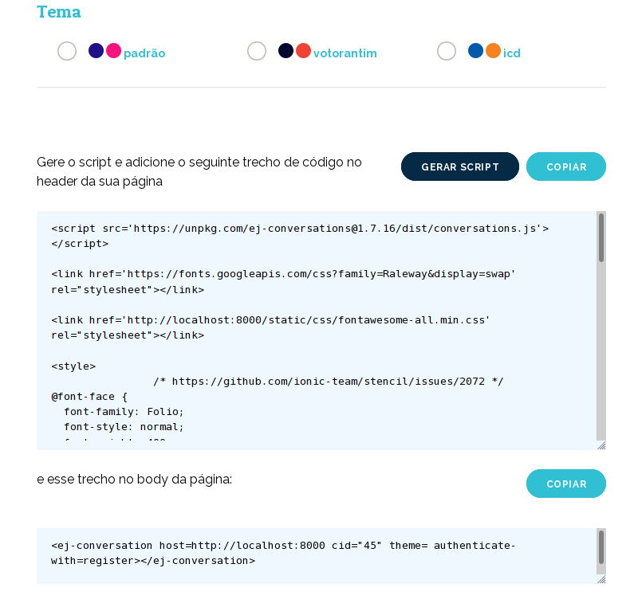

######################
Componente de opinião
######################

O componente de opinião permite que você faça coletas de opinião em sites e blogs sem
que o seu público perca a experiência de usuário, evitando o redirecionamento para outro
sistema. O seu visitante poderá votar, adicionar novos comentários e visualizar
informações relacionadas aos grupos de opinião formados durante a conversa. O componente possui
duas configurações chave, que são o método de autenticação e o tema visual quer será utilizado.

Autenticação
-------------

Como o visitante não é redirecionado para a EJ mas ainda precisa estar autenticado para participar de uma conversa, o componente oferece três métodos de autenticação.

* **registro por nome e email**: O usuário irá informar um nome e um email para se registrar na EJ. Uma senha será gerada a partir dessas duas informações. A partir do registro, ele segue para a próxima tela e pode então participar.

* **analytics**: O usuário não irá precisar informar nada para participar, mas o gestor do site irá precisar configurar uma *tag* do analytics, para que via cookie este usuário possa ser autenticado na API da EJ. Esse cookie poderá ser utilizado em um segundo momento pelo administrador da conversa, para cruzar dados de opinião com o comportamento do usuário no site, tendo mais pontos de informação sobre o seu público.

* **mautic**: O usuário não irá precisar informar nada para participar, mas o gestor do site irá precisar configurar uma *tag* do mautic, para que via cookie, este usuário possa ser autenticado na API da EJ. Esse cookie poderá ser utilizado em um segundo momento pelo administrador da conversa, para cruzar dados de opinião com dados existentes na instância do mautic que está sendo utilizado.

Temas
-------------

O componente possui três temas visuais que podem ser escolhidos na tela de configuração da ferramenta.

Incluíndo o componente em uma pagina
-------------------------------------
Para iniciar a configuração do componente de opinião, o primeiro passo
é seguir o fluxo de configuração na tela interna da ferramenta. 

Um vez incluído os scripts na pagina, o componente deve carregar automaticamente.

Correções de css na pagina do componente
----------------------------------------

O componente fará o melhor possível para carregar bem enquadrado e responsivo, mas é possível que, dependendo de como a pagina foi construída, sejam necessários alguns ajustes no css para que o componente seja apresentado corretamente. Ferramentas como o Divi_, muito utilizado no Wordpress para construção de sites, normalmente exigem algumas customizações para não quebrar o componente. Para corrigir as imagens anteriores, por exemplo, o seguinte css foi alterado no tema da página:

.. code-block:: css

  .et_pb_row {
    max-width: unset !important;
    width: unset !important;
    padding: unset !important;
  }
  .et_pb_section {
    padding: unset !important;
  }

  .. _Divi: https://www.elegantthemes.com/gallery/divi/
