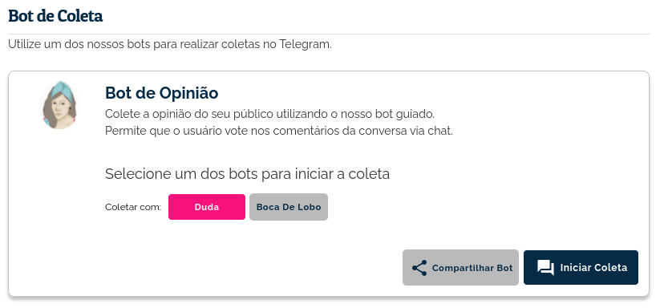
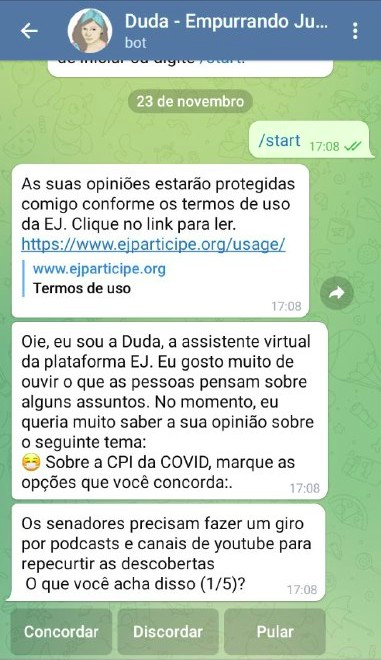
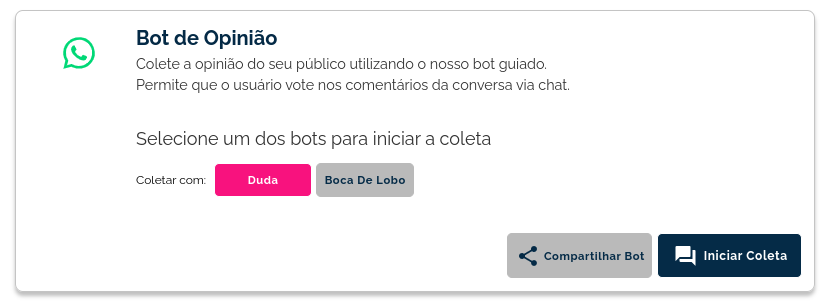
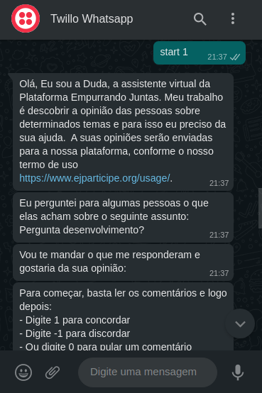
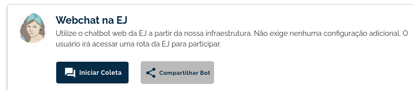
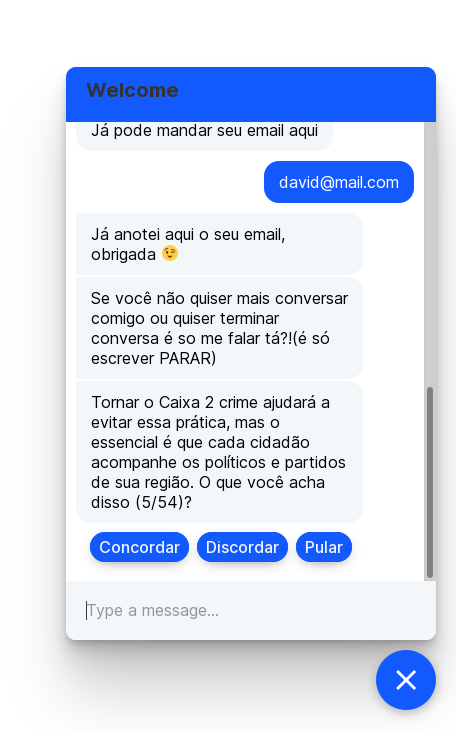
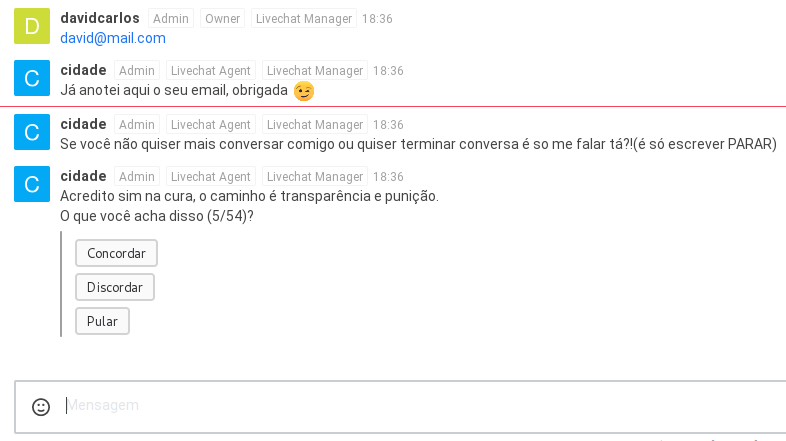
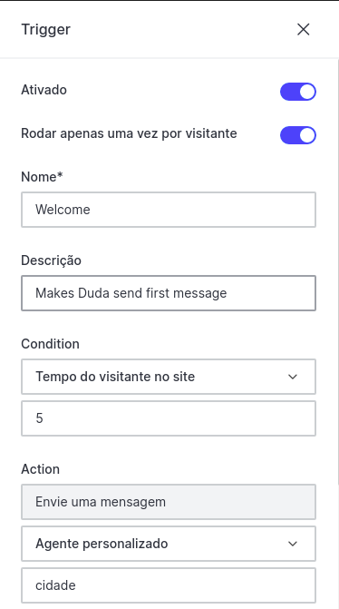
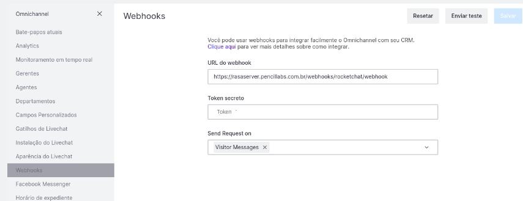

##############################
Duda: O chatbot oficial da EJ
##############################

.. _Bot de Opinião:

A EJ permite realizar coletas de opinião através de uma interface conversacional em que o
participante vota nos comentários e adiciona comentários,  que ficam disponíveis para os demais
participantes votarem. Essa estrutura de chat permite realizar coletas no Telegram, WhatsApp ou página web.

Para instruções técnicas de como rodar o chatbot da EJ em
um ambiente de homologação, acesse https://gitlab.com/pencillabs/ej/ej-bot.

Quando devo utilizar o Bot de Opinião?
========================================

O bot de opinião é especialmente útil para usuários que gerenciam grupos no Telegram ou WhatsApp e
desejam que os integrantes participem das coletas sem sair dos applicativos de mensageria.
Também é possível utilizar o bot de opinião em páginas html, por meio da ferramenta :ref:`Webchat`.

Telegram
==========================================

Para participar de uma coleta no Telegram é necessário gerar o link de participação. Esse link é
uma URL que aponta para o chat da Duda, nosso bot de opinião disponível no plano gratuito da ferramenta.
Para gerar o link de participação acesse a área de **Ferramentas > Bot de Opinião > Telegram**.
A área de ferramentas pode ser encontrada na página interna de uma conversa.

Nessa tela, você terá duas opções:

1. Iniciar a coleta da conversa em questão no Telegram, por meio do botão **Iniciar Coleta**.
2. Gerar o link da coleta, por meio do botão **Compartilhar Bot**. Esse botão irá copiar para a área
   de transferência o link de participação e um texto de convie, que poderá ser alterado posteriormente.

Ao clicar no link, o participante é direcionado para o chat privado com o Bot.

WhatsApp
==========================================

Para participar de uma coleta no WhatsApp é necessário gerar o link de participação. Esse link é
uma URL que aponta para o chat da Duda, nosso bot de opinião disponível no plano pago da ferramenta.
Para gerar o link de participação acesse a área de **Ferramentas > Bot de Opinião > WhatsApp**.
A área de ferramentas pode ser encontrada na página interna de uma conversa.

Nessa tela, você terá duas opções:

1. Iniciar a coleta da conversa em questão no WhatsApp, por meio do botão **Iniciar Coleta**.
2. Gerar o link da coleta, por meio do botão **Compartilhar Bot**. Esse botão irá copiar para a área
   de transferência o link de participação e um texto de convie, que poderá ser alterado posteriormente.

Ao clicar no link, o participante é direcionado para o chat privado com o Bot.

.. _Webchat:

Webchat
==========================================
O Webchat é uma das ferramentas de coleta da EJ e permite integrar o bot de opinião em uma página web.
Essa página pode ser desde um post em um blog até uma plataforma de e-commerce. 

Como posso utilizar a ferramenta?
----------------------------------

Exitem duas formas de utilizar o Webchat.

1. Utilizando um link que a própria EJ disponibiliza. Esse link pode ser compartilhado com o seu público,
   que irá conseguir participar de uma coleta sem que você tenha que fazer qualquer outro procedimento.
   Basta ir na área da ferramenta, clicar no botão **Compartilhar Bot** e o link para a coleta será 
   copiado para a área de transferência.
   Ao clicar nesse link, o usuário é redirecionado para uma página da EJ com o WebChat integrado. 
   A partir dai, basta ele participar da coleta. 
   O botão **Iniciar Coleta** é um atalho para que o criador da conversa possa testar a integração com o Webchat.

2. Integrando o script do Webchat em uma página html qualquer. Essa opção permite que você integre o Webchat no seu site, o que facilita a jornada do usuário, já que ele não será redirecionado para uma página da EJ. O script de integração permite que o Webchat, mesmo rodando fora da EJ, apresente a conversa que você criou.
Caso opte por integrar o Webchat no seu site, o seguinte script pode ser utilizado como ponto de partida da integração. Note que você estará sujeito aos limites de uso do plano gratutito, caso seja o seu caso.

.. code-block:: html

   <html>
      <head></head>
      <body></body>
      
      
   </html>

Uma vez configurado o script na página, será necessário registrar na EJ a URL em que o webchat está integrado. Dessa forma, o bot saberá qual conversa da EJ ele deve apresentar para o visitante.

Para realizar esse registro, basta acessar a área de **ferramentas** da conversa, clicar em **Bots de Opinião** e selecionar a ferramenta **WebChat**. Cadastre então a URL em que o script foi configurado.
Essa URL tem que ser exatamente igual à url em que o script do Webchat será configurado.
Feito isso, o webchat irá apresentar para os visitantes a conversa integrada.

Quando devo utilizar o WebChat? 
--------------------------------

Recomendamos utilizar o Webchat para situações em que utilizar o Telegram não é uma opção. 
O usuário irá participar votando nos comentários e poderá adicionar um novo comentário, que será solicitado pelo bot. 
Uma das vantagens do Webchat em relação ao Telegram é que ele pode ser integrado ao seu site ou plataforma web.

Rocket.chat
==========================================

Caso você queira integrar a Duda à uma instância do Rocket.chat, siga os passos a seguir.

1. Crie no Rocket.chat um usuário com as mesmas credenciais presentes no arquivo `bot/credentials.yml`, no respositório do ejBot;

  * Esse usuário deve ter o papel `bot`, atrelado a sua conta;
  * No `bot/credentials.yml` deve haver uma configuração apontanto para a instância do Rocket.chat;

2. Crie um novo canal, e adicione o usuário bot como participante;

3. Ainda no Rocket, Vá em Administração -> Integrações, e crie uma nova integração de saída (*Outgoing*);

  * No campo url, informe a url da instância do Rasa, por exemplo: https://rasaserver.pencillabs.com.br/webhooks/rocketchat/webhook
  * Preencha os outros campos, de acordo com o nome do canal que foi criado e o nome do usuário bot;

Se tudo foi feito corretamente, agora basta mandar uma mensagem no canal, que a Duda irá responder.

.. _Rasa: https://rasa.com/ 
.. _rasa-webchat: https://github.com/botfront/rasa-webchat

Livechat
---------

Para utilizar o bot no modo livechat do rocketchat é necessário fazer algumas configurações.

1. Em Ominichannel > Gatilhos de Livechat, crie um novo gatilho:

  * Ative as opções Ativo e Rodar apenas uma vez por visitante;
  * Condition: Tempo de visitante no site;
  * Action - Envie uma mensagem: Escolha a opção "Agente personalizado". Logo abaixo digite o nome do agente do bot no rocketchat. Por fim coloque a mensagem de ` welcome` do bot. Depois clique em salvar.

2. Em Webhooks, caso não configurado, configure da seguinte forma:

  * URL do webhook: https://rasaserver.pencillabs.com.br/webhooks/rocketchat/webhook;
  * Token secreto: Insira o token de acesso;
  * Send Request on: Selecione Visitor Messages. Depois clique em salvar.

3. Para testar basta ir em Instalação do Livechat copiar o codigo no seu website.

.. figure:: ../images/ej-rasa-livechat-install.png

Como obter mais informações sobre o ambiente de desenvolvimento?
====================================================================================
Para saber mais detalhes sobre o ambiente de desenvolvimento, basta acessar o `repositório de implementação do bot <https://gitlab.com/pencillabs/ej/ej-bot#ej-bot>`_.

