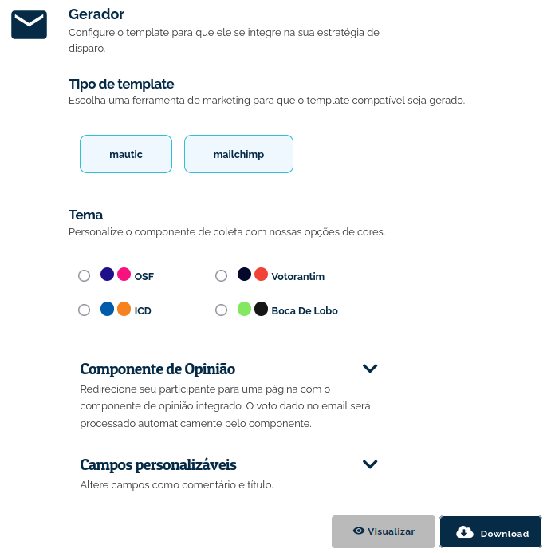
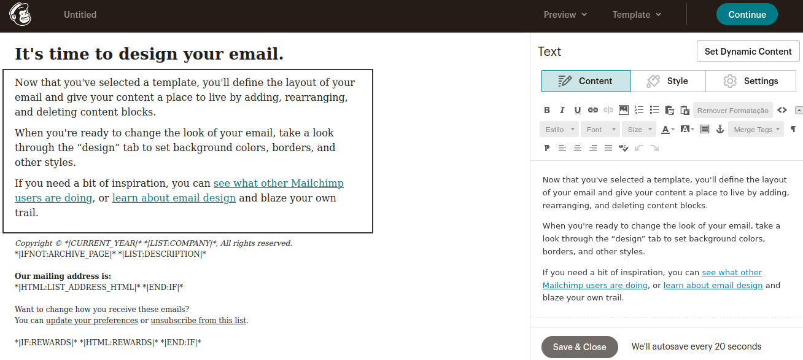

##################
Campanha de email
##################

A ferramenta Campanha de email, permite realizar coletas de opinião a partir emails enviados
em massa ou para usuários específicos, a partir de plataformas de *mailmarketing* como Mailchimp e Mautic.
O usuário recebe um email o convidando a participar de uma conversa da EJ. Ao clicar em um dos
botões de voto, ele pode ser redirecionado para uma página em que o Componente de opinião
esteja integrado.

.. figure:: ../images/mail-campaign-preview.png

O template de email gerado na EJ irá simular a tela de participação do Componente de opinião,
para quando o usuário for redirecionado, ele esteja com um ambiente visualmente compatível.

Componente de opinião - Redirecionamento
----------------------------------------
Por padrão, o template terá links de redirecionamento ligados à instância da EJ em que o template de email foi gerado.
Na tela de configuração existe a opção de redirecionar o usuário para um domínio diferente do padrão.

Utilizando o template gerado
----------------------------
Para certificar-se que o template gerado está de acordo com o desejado, pode-se realizar uma
pré visualização antes do download do mesmo.

Ferramentas como o mautic permitem a criação de campanhas de email. A ferramenta aqui apresentada
gera um arquivo HTML que pode ser adicionado em campanhas que serão disparadas.

Automação de Marketing digital
------------------------------
As plataformas de marketing digital que são compatíveis atualmente com o EJ são o mautic e o mailchimp.
Como o template gerado é em HTML, pode ser que haja compatibilidade em outros ambientes, mas não há garantia.

Mailchimp
~~~~~~~~~

O que é o Mailchimp?
********************

O Mailchimp é uma plataforma de automação de marketing e serviço de email marketing.
No contexto da EJ, é possível coletar informações de pessoas que demonstraram interesse
em algum segmento da plataforma de coleta de opinião.

Com o Mailchimp, é possível criar campanhas de e-mail, publicidade nas redes sociais,
coleta de dados sobre interações do usuário com o site, entre outras funcionalidades.
Para saber mais, `acesse a documentação do Mailchimp <https://mailchimp.com/pt-br/resources/mailchimp-101/>`_.

Como a EJ se conecta com o Mailchimp?
*************************************

A EJ se conecta com o Mailchimp a partir do template HTML gerado na página de Campanha de e-mail.
Com o template gerado, é possível inseri-lo no layout do e-mail que você deseja enviar para seu
público.

Como faço para criar e configurar um template de e-mail de uma conversa na EJ?
******************************************************************************

1. Para iniciar, primeiramente é necessário acessar a página de Campanha de e-mail a partir de uma conversa selecionada;
2. Em seguida, no "Gerador de template", selecione a opção "Mailchimp" e escolha o tema para o template;
3. Na opção de "Componente de opinião, clique e insira um endereço em que um Componente de Opinião esteja sendo executado;
4. A partir deste momento, clique na opção de "Download" e o template está e pronto para ser importado no Mailchimp.

Como faço para enviar um template gerado pela EJ para meu público?
******************************************************************

1. A partir do template gerado na seção anterior, entre em sua conta do Mailchimp e clique em "Todas as campanhas";

2. Em seguida, no canto direito há um botão de "Criar campanha". Clique nesta opção;

3. Escolha o tipo de layout "E-mail builder" para criar o e-mail;

4. Selecione o "Construtor Clássico";

5. O Mailchimp disponibiliza diversos templates para escolha, de acordo com o seu objetivo. Para este teste, foi escolhido o template "1 Column" ou "1 Coluna";

6. Na tela a seguir você visualizará o template escolhido com alguns blocos de exemplo para montar seu e-mail. Sinta-se livre para customizar itens como header, logo, informações de contato, entre outros, ou se preferir, exclua os existentes;

7. Crie ou reutilize um desses blocos para colar o template gerado na EJ. Para isso, em um editor de texto, copie todo o conteúdo HTML do template gerado;

8. Na caixa de escrita do bloco, antes de colar o conteúdo, selecione a opção de código, delimitada por este ícone: "**<>**". Desta forma, cole no bloco que você escolheu para o template e já será possível visualizar o template.

9. Clique no botão de "Salvar e fechar" e em seguida, clique em "Continuar". Você será redirecionado a outra tela de configuração;

10. Preencha então as opções necessárias para o envio completo, como `adicionar contatos <https://mailchimp.com/help/import-contacts-mailchimp/>`_, dados do remetente, assunto do e-mail e o conteúdo logo abaixo, que é o template de e-mail.

11. Se tudo estiver certo, já é possível enviar o template de e-mail para o seu público e acompanhar os dados de envio, como quantas pessoas abriram o email, quantas clicaram, onde clicaram, entre outros recursos.

Mautic
~~~~~~

O que é o Mautic?
*****************

O Mautic é uma plataforma para automação de marketing e gerenciamento de leads.
Leads são oportunidades de negócio para uma organização. No contexto da EJ,
leads são pessoas que demonstraram interesse em algum segmento da plataforma
da plataforma de coleta de opinião.

Com o Mautic, é possível criar campanhas de email, publicidade nas redes sociais,
coleta de dados sobre interações do usuário com o site, entre outras funcionalidades.
Para saber mais, `acesse a documentação do Mautic <https://www.mautic.org/>`_.

Como a EJ se conecta com o Mautic?
**********************************

A EJ se conecta com o Mautic a partir da `API <https://developer.mautic.org/?json#rest-api>`_ disponibilizada.
Com ela, é possível utilizar suas funcionalidades a partir da plataforma EJ utilizando a autenticação oAuth2 com a chave pública e a chave secreta da sua instância do Mautic.

Como faço para configurar a instância do Mautic para conectar à EJ?
*******************************************************************

Para iniciar a configuração do Mautic com a EJ, primeiramente é necessário
ter uma instância do Mautic com o protocolo HTTPS em execução.

Para a EJ se comunicar com a instância do Mautic, são necessários alguns dados.
Esses dados são a chave pública (ou client id) e a chave secreta (ou client secret).
Ambas são encontradas seguindo os seguintes passos:

1. Acesse a instância do Mautic de interesse e realize o login;

    * Sua instância deverá possuir o protocolo HTTPS para fins de segurança.
2. Acesse as configurações, por meio do ícone que se encontra no menu direito superior;
3. Clique na opção "Credenciais API"
4. Clique no botão "Novo", localizado no canto direito superior;
5. Aparecerá a seguinte tela. Onde está o tipo de autenticação "OAuth 1.0a", clique e altere para a opção "OAuth 2";
    .. figure:: ../images/api-credentials-mautic1.png

6. Dê um nome para sua conexão e digite o link para redirecionamento;

    * O link de redirecionamento, nesse caso é o link da conversa selecionada na página da EJ. Ela ficará com o seguinte padrão: https://www.ejparticipe.org/conversations/id-da-conversa/nome-da-conversa/tools/mautic
    * O caminho para chegar a esse link na EJ é: vá para a página de conversas -> selecione sua conversa -> clique em ferramentas -> Mautic -> copie o link do navegador

.. figure:: ../images/api-credentials-mautic2.png

7. Clique no botão "Salvar e fechar";
8. Verifique que agora você pode visualizar a chave pública e a chave secreta. São elas que você precisará para conectar sua instância à EJ.

    * Você pode copiar e colar cada uma delas diretamente do Mautic para o formulário da EJ.

Como faço para começar a utilizar o Mautic em uma conversa?
***********************************************************

Após finalizar a configuração no Mautic, você pode começar a preencher o formulário da EJ para conexão.

A dinâmica da EJ com o Mautic é realizada a partir do menu lateral "Ferramentas",
diretamente a partir de uma conversa na qual **você é o autor**.

Em seguida, acesse a opção "Mautic" e clique no botão para habilitar integração.

Para se comunicar com a instância do Mautic, é necessário inserir alguns dados.
Esses dados são a chave pública (ou client id), a chave secreta (ou client secret) e a URL da sua instância do Mautic.

    * URL da instância do Mautic deve adotar o protocolo HTTPS, por exemplo: https:your-mautic-instance.com

Como os contatos são criados?
*****************************

Finalizando a configuração do Mautic na sua instância, e em seguida for preenchido o formulário na EJ com as credenciais válidas,
cada vez que um participante votar em sua pesquisa de opinião, um contato no Mautic será criado.
Esse contato é criado na sua instância com o número de telefone do seu usuário da EJ.

Como posso visualizar os contatos criados?
******************************************

Pelas características do contato criado na EJ, o contato é criado na instância do Mautic como um contato anônimo.
O contato criado pode ser visto clicando no seguinte ícone à direita superior da página:

.. figure:: ../images/mautic-icon.png
    :align: center

Como funciona o fluxo de autenticação e criação de uma conversa?
****************************************************************

O fluxo de autenticação e de criação de um contato no Mautic é realizada por meio de uma prévia autenticação com OAuth2 e utilizando a API do Mautic.

As imagens a seguir ilustram o fluxo completo.

.. figure:: ../images/mautic-diagram.png
    :align: center

.. figure:: ../images/mautic2-diagram.jpg
    :align: center
