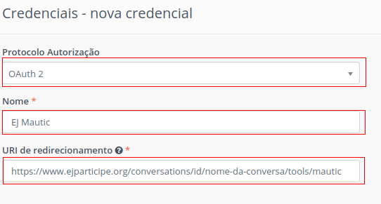

##############################
Mautic: Automação de marketing
##############################

O que é o Mautic?
-----------------
O Mautic é uma plataforma para automação de marketing e gerenciamento de leads.
Leads são oportunidades de negócio para uma organização. No contexto da EJ, 
leads são pessoas que demonstraram interesse em algum segmento da plataforma 
da plataforma de coleta de opinião.

Com o Mautic, é possível criar campanhas de email, publicidade nas redes sociais,
coleta de dados sobre interações do usuário com o site, entre outras funcionalidades. 
Para saber mais, `clique aqui <https://www.mautic.org/>`_. 

Como a EJ se conecta com o Mautic?
----------------------------------
A EJ se conecta com o Mautic a partir da `API <https://developer.mautic.org/?json#rest-api>`_ disponibilizada.
Com ela, é possível utilizar suas funcionalidades a partir da plataforma EJ utilizando a autenticação oAuth2 com a chave pública e a chave secreta da sua instância do Mautic.

Como faço para configurar a instância do Mautic para conectar à EJ?
-------------------------------------------------------------------
 
Para iniciar a configuração do Mautic com a EJ, primeiramente é necessário
ter uma instância do Mautic com o protocolo HTTPS em execução.  

Para a EJ se comunicar com a instância do Mautic, são necessários alguns dados. 
Esses dados são a chave pública (ou client id) e a chave secreta (ou client secret).
Ambas são encontradas seguindo os seguintes passos: 

1. Acesse a instância do Mautic de interesse e realize o login;
    
    * Sua instância deverá possuir o protocolo HTTPS para fins de segurança.
2. Acesse as configurações, por meio do ícone que se encontra no menu direito superior;
3. Clique na opção "Credenciais API"
4. Clique no botão "Novo", localizado no canto direito superior;
5. Aparecerá a seguinte tela. Onde está o tipo de autenticação "OAuth 1.0a", clique e altere para a opção "OAuth 2";
    .. figure:: ../images/api-credentials-mautic1.png

6. Dê um nome para sua conexão e digite o link para redirecionamento;
    
    * O link de redirecionamento, nesse caso é o link da conversa selecionada na página da EJ. Ela ficará com o seguinte padrão: https://www.ejparticipe.org/conversations/id-da-conversa/nome-da-conversa/tools/mautic
    * O caminho para chegar a esse link na EJ é: vá para a página de conversas -> selecione sua conversa -> clique em ferramentas -> Mautic -> copie o link do navegador

7. Clique no botão "Salvar e fechar"; 
8. Verifique que agora você pode visualizar a chave pública e a chave secreta. São elas que você precisará para conectar sua instância à EJ.
    
    * Você pode copiar e colar cada uma delas diretamente do Mautic para o formulário da EJ.

Como faço para começar a utilizar o Mautic em uma conversa?
-----------------------------------------------------------

Após finalizar a configuração no Mautic, você pode começar a preencher o formulário da EJ para conexão.

A dinâmica da EJ com o Mautic é realizada a partir do menu lateral "Ferramentas", 
diretamente a partir de uma conversa na qual **você é o autor**.

Em seguida, acesse a opção "Mautic" e clique no botão para habilitar integração.

Para se comunicar com a instância do Mautic, é necessário inserir alguns dados. 
Esses dados são a chave pública (ou client id), a chave secreta (ou client secret) e a URL da sua instância do Mautic.
    
    * URL da instância do Mautic deve adotar o protocolo HTTPS, por exemplo: https:your-mautic-instance.com

Como os contatos são criados?
-----------------------------
 
Finalizando a configuração do Mautic na sua instância, e em seguida for preenchido o formulário na EJ com as credenciais válidas,
cada vez que um participante votar em sua pesquisa de opinião, um contato no Mautic será criado.
Esse contato é criado na sua instância com o número de telefone do seu usuário da EJ.

Como posso visualizar os contatos criados?
------------------------------------------

Pelas características do contato criado na EJ, o contato é criado na instância do Mautic como um contato anônimo.
O contato criado pode ser visto clicando no seguinte ícone à direita superior da página: 

.. figure:: ../images/mautic-icon.png
    :align: center

Como funciona o fluxo de autenticação e criação de uma conversa?
----------------------------------------------------------------

O fluxo de autenticação e de criação de um contato no Mautic é realizada por meio de uma prévia autenticação com OAuth2 e utilizando a API do Mautic.

As imagens a seguir ilustram o fluxo completo.

.. figure:: ../images/mautic-diagram.png
    :align: center

.. figure:: ../images/mautic2-diagram.jpg
    :align: center