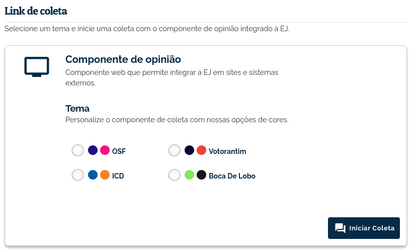
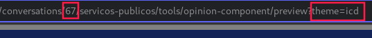

######################
Componente de opinião
######################

O componente de opinião é uma ferramenta de coleta que pode ser integrada em páginas html. 
A ferramenta permite que usuários que acessem a página votem em uma conversa e adicionem novos
comentários. Estes comentários poderão ser moderados na área **Gerenciar comentários** e ficarão disponíveis 
para outros participantes, caso o dono da conversa aprove.
Todos os votos e comentários feitos no componente ficam disponíveis no *dashboard* da conversa.

Quando devo utilizar o Componente de Opinião?
==============================================

O Componente de Opinião é especialmente útil para usuários que possuem sites, blogs ou plataformas
web e querem que seu público participe de coletas nestes ambientes. Assim como o Componente de Opinião,
a ferramenta :ref:`Webchat` também pode ser integrada em páginas html.
Diferente de outras ferramentas de coleta, o Componente de Opinião oferece dois mecanismos de
autenticação, que serão abordados a seguir.

O componente possui duas configurações-chave, o método de autenticação e o tema visual que será utilizado.

Autenticação
-------------

Como o visitante não é redirecionado para a EJ, mas precisa estar autenticado para participar 
de uma conversa, o Componente oferece dois métodos de autenticação.

* **registro por nome e email**: O usuário irá informar um nome e um email para se registrar na EJ. 
  Uma senha será gerada a partir dessas duas informações. 
  Uma vez registrado, o usuário segue para a próxima tela e pode então participar.

* **padrão**: O usuário precisará informar nada para participar, o próprio componente irá
  gerar credenciais aleatórias para autenticação. Esse método é util se você não deseja identificar
  seus participantes e, por não ter tela de login, a experiência de votação é mais fluida.

Temas
-------------

O Componente possui quatro temas visuais que podem ser escolhidos na tela de configuração da ferramenta.

.. figure:: ../images/ej-opinion-component-theme.png

Como posso utilizar a ferramenta?
----------------------------------

Exitem duas formas de utilizar o Componente de Opinião.

1. Utilizando a página integrada da EJ. Com ela, você não precisa ter um site ou sistema web para
   realizar coletas com o Componente de Opinião. Basta acessar **Ferramentas > Componente de Opinião**
   e clicar no botão **Iniciar Coleta**. A página integrada da EJ utiliza o mecanismo de autenticação
   padrão, comentado anteriormente. A vantagem dessa opção é que você pode copiar a URL da EJ e utilizá-la
   em publicações para redes sociais ou mensagens diretas para os usuários. Quem clicar no link, irá
   ser redirecionado para a página da EJ e conseguirá particiar da coleta. Essa forma democratiza
   o acesso à ferramenta, já que mesmo que você não tenha um site ainda assim conseguirá fazer a coleta.

2. :ref:`Configurando o script do Componente no seu site ou página html`.

.. _Configurando o script do Componente no seu site ou página html:

Incluíndo o componente em uma pagina
-------------------------------------
Para incluir o componente de opinião em uma página basta copiar o script abaixo e substituir as variáveis pelos valores desejados:

* **$CONVERSATION_ID**: Identificador da conversa na EJ.
* **$THEME**: Tema.
* **$AUTHENTICATION**: Metodo de autenticação.

O **$CONVERSATION_ID** e o **$THEME** a serem utilizados podem ser encontrados na url da pagina da ferramenta:

.. figure:: ../images/ej-opinion-component-link.png

A variável ``$AUTHENTICATION`` aceita os seguintes valores:

* ``default`` (autenticação por nome e email)
* ``register`` (autenticação pela tela de registro)

Caso queria utilizar uma versão diferente ou verificar qual a última versão publicada no npm acesse:
https://www.npmjs.com/package/ej-conversations

.. code-block:: html

  <meta name="viewport" content="width=device-width, initial-scale=1">
  
  <link href="https://fonts.googleapis.com/css?family=Raleway&display=swap" rel="stylesheet">
  <link href="https://www.ejparticipe.org/static/css/fontawesome-all.min.css" rel="stylesheet">
  

  <!-- elemento responsável por carregar o componente de opinião na página html -->
  <ej-conversation host="https://www.ejparticipe.org" cid="$CONVERSATION_ID" theme="$THEME" authenticate-with="$AUTHENTICATION"></ej-conversation>

Correções de css na pagina do componente
----------------------------------------

O componente fará o melhor possível para carregar bem enquadrado e responsivo, mas é possível que, dependendo de como a pagina foi construída, sejam necessários alguns ajustes no css para que o componente seja apresentado corretamente. Ferramentas como o Divi, muito utilizado no Wordpress para construção de sites, normalmente exigem algumas customizações para não quebrar o componente. Para corrigir as imagens anteriores, por exemplo, o seguinte css foi alterado no tema da página:

.. code-block:: css

  .et_pb_row {
    max-width: unset !important;
    width: unset !important;
    padding: unset !important;
  }
  .et_pb_section {
    padding: unset !important;
  }

  .. _Divi: https://www.elegantthemes.com/gallery/divi/
