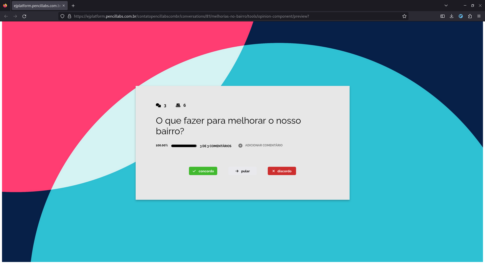
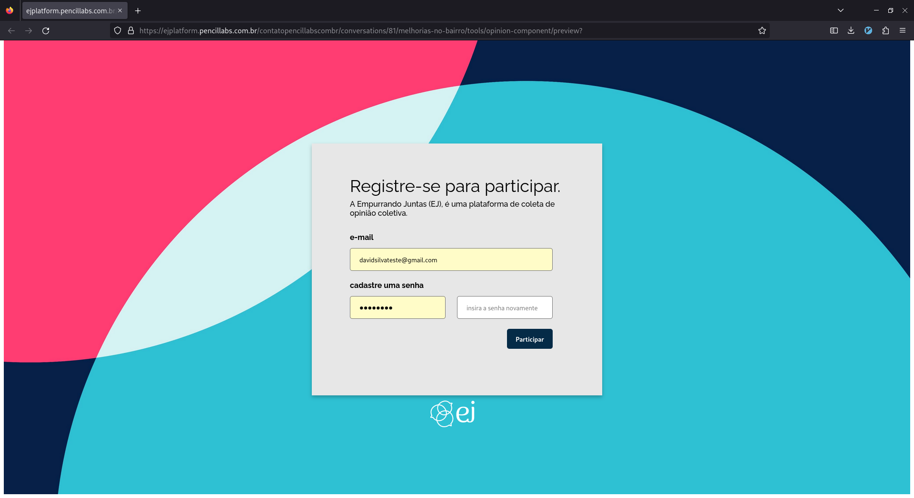

######################
Componente de opinião
######################

O componente de opinião é um projeto desenvolvido separadamente do código principal da EJ.
Seu objetivo integrar a jornada de participação em sites e plataformas de terceiros. Em resumo,
o componente funciona da seguinte forma:

1. Usuário da EJ cria uma nova conversa (ou seleciona uma já existente).
2. Usuário da EJ integra o componente de opinião em uma página externa, como um site ou blog.
3. Visitante acessa o site ou blog, vota e comenta na conversa criada anteriormente.
4. Votos e comentários dados no componente são enviados para a EJ via API.

O Componente permite um fluxo de participação mais fluido, já que o usuário não precisa ser redirecionado
para a EJ, a participação acontece no site que ele já tem o costume de acessar.
Isso é possível porque o projeto é desenvolvido utilizando o
framework `Stencil <https://stenciljs.com/>`_.
Este framework permite criar componentes web reusáveis, que uma vez
carregados em páginas HTML, adicionam novos comportamentos e funcionalidades ao site.
Ao utilizar o componente de opinião, o administrador da conversa é capaz reaproveitar acessos
ao seu site ou plataforma para realizar uma pesquisa de opinião, sem exigir que este visitante tenha que ser redirecionado para a página de cadastro da EJ.

Quando devo utilizar o Componente de Opinião?
==============================================

O Componente de Opinião é especialmente útil para usuários que possuem sites, blogs ou plataformas
web e querem que seu público participe de coletas nestes ambientes.
Assim como o Componente de Opinião, a ferramenta :ref:`Webchat` também pode ser integrada em páginas html.

Autenticação
-------------

Para participar da conversa, o visitante precisa estar autenticado na API da EJ. Isso é feito por
meio de um formulário de cadastro que, uma vez preenchido, cadastrará um novo usuário
via API, permitindo que o mesmo vote e adicione comentários.

Como posso utilizar a ferramenta?
----------------------------------

Exitem duas formas de utilizar o Componente de Opinião.

1. Utilizando a página integrada da EJ. Com ela, você não precisa ter um site ou sistema web para
   realizar coletas com o Componente de Opinião. Basta acessar **Ferramentas > Componente de Opinião**
   e clicar no botão **Iniciar Coleta**. A vantagem dessa opção é que você pode copiar a URL da EJ e utilizá-la
   em publicações para redes sociais ou mensagens diretas para os usuários. Quem clicar no link, irá
   ser redirecionado para a página da EJ e conseguirá particiar da coleta. Essa forma democratiza
   o acesso à ferramenta, já que mesmo que você não tenha um site ainda assim conseguirá fazer a coleta.

.. figure:: ../images/ej-opinion-component-start.png

2. A segunda forma é integrando o componente ao seu site ou plataforma web. Apresenteremos o passo a passo a seguir.

.. _Configurando o componente no seu site ou página html:

Configurando o componente no seu site ou página html
-----------------------------------------------------

Para integrar o componente de opinião em uma página HTML, copie e cole o *snippet* a seguir para a página desejada.

.. code-block:: html
   :caption: *snippet* html para integração

    <meta name="viewport" content="width=device-width, initial-scale=1.0, minimum-scale=1.0, maximum-scale=5.0">
    <link rel="preconnect" href="https://fonts.googleapis.com">
    <link rel="preconnect" href="https://fonts.gstatic.com" crossorigin>
    <link href="https://fonts.googleapis.com/css2?family=Raleway:wght@400;500;700&display=swap" rel="stylesheet">
    
    <link rel="stylesheet" href="https://cdnjs.cloudflare.com/ajax/libs/font-awesome/6.3.0/css/v4-font-face.min.css" integrity="sha512-p0AmrzKP8l63xoFw9XB99oaYa40RUgDuMpdkrzFhi4HPHzO3bzyN2qP6bepe43OP3yj9+eGQEJGIGPcno1JdPw==" crossorigin="anonymous" referrerpolicy="no-referrer" />
    <link rel="stylesheet" href="https://unpkg.com/ej-conversations/dist/conversations/conversations.css">
    <ej-conversation conversation-author-token="" host=HOST cid=CONVERSATION_ID></ej-conversation>

Com o *snippet* copiado para a página, substitua no código copiado as variáveis `HOST` e `CONVERSATION_ID` pelos valores desejados:

* **CONVERSATION_ID**: Identificador da conversa na EJ, por exemplo, "`56`".
* **HOST**: URL para a plataforma EJ, por exemplo, "`https://ejplatform.org <https://ejplatform.org>`_".

O **CONVERSATION_ID** pode ser encontrado na url da conversa criada na EJ. No exemplo da imagem, o ID é o número que aparece depois de `conversations/` e antes de `/servicos-publicos/`.

.. fgure:: ../images/ej-opinion-component-link.png
.. figure:: ../images/ej-opinion-component-link1.png

Feita a configuração, o browser irá carregar o componente e o visitante poderá iniciar sua participação na conversa escolhida.
Para mais informações técnicas, acesse o `repositório do projeto <https://gitlab.com/pencillabs/ej/conversation-component>`_.

Correções de css na pagina do componente
----------------------------------------

O componente fará o melhor possível para carregar bem enquadrado e responsivo, mas é possível que, dependendo de como a pagina foi construída, sejam necessários alguns ajustes no css para que o componente seja apresentado corretamente. Ferramentas como o Divi, muito utilizado no Wordpress para construção de sites, normalmente exigem algumas customizações para não quebrar o componente. Para corrigir as imagens anteriores, por exemplo, o seguinte css foi alterado no tema da página:

.. code-block:: css

  .et_pb_row {
    max-width: unset !important;
    width: unset !important;
    padding: unset !important;
  }
  .et_pb_section {
    padding: unset !important;
  }

  .. _Divi: https://www.elegantthemes.com/gallery/divi/
