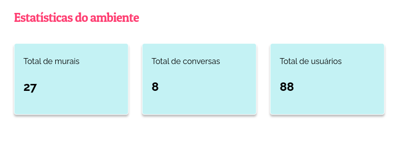
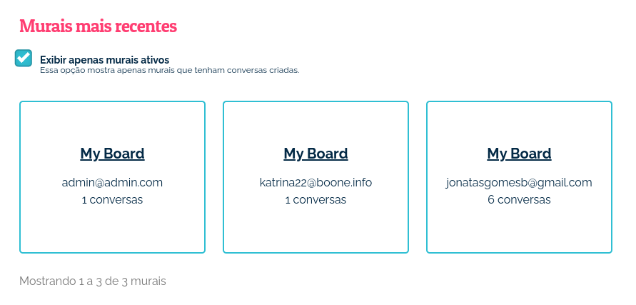
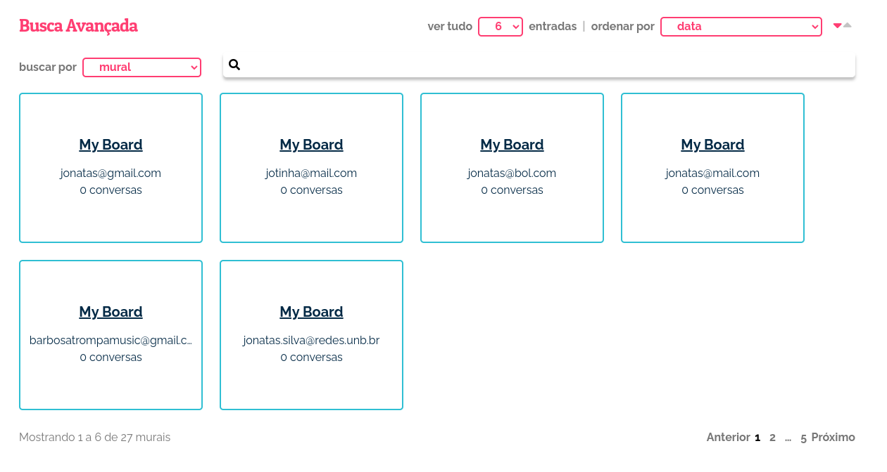

Entendendo o Ambiente EJ
========================

.. contents::
   :depth: 2

O que é o Ambiente EJ?
----------------------
A nossa plataforma disponibiliza uma área de gestão do ambiente, onde os administradores da página podem visualizar as estatísticas do ambiente e dados relacionados ao que é gerado na EJ.

Estatísticas do ambiente
------------------------
Nesta seção, você pode visualizar as estatísticas do ambiente de forma geral, podendo visualizar o total de murais, total de conversas e total de usuários.

Murais mais recentes
--------------------

Nesta seção, é possível visualizar os murais criados mais recentemente, seus criadores e a quantidade de conversa de cada um desses murais, além de poder alternar entre visualizar apenas os murais ativos ou não.

Busca Avançada
--------------
Seção destinada ao usuário que quer fazer buscas avançadas no ambiente, podendo buscar por murais, conversas e usuários, junto aos seus dados relacionados na EJ.

É possível ordenar os resultados de acordo com a data de criação, número de comentários e número de conversas.

