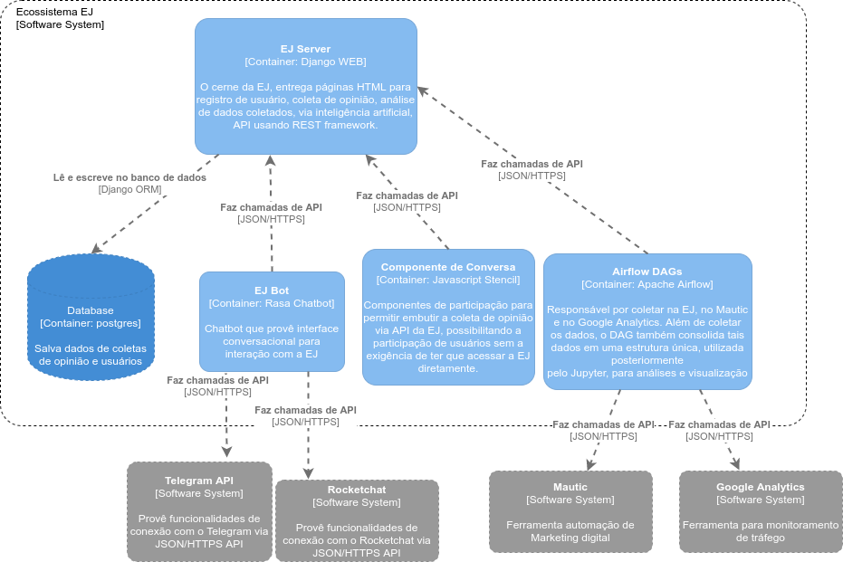

===========
Arquitetura
===========

.. contents::
   :depth: 2

Visão de alto nível
===================

EJ adota uma arquitetura monolítica com o servidor principal que controla a
lógica de negócios e alguns serviços adicionais que complementam o aplicativo.
A maneira recomendada de distribuir o EJ é executar cada serviço em um
recipiente separado a fim fornecer um bom nível de isolação. Na imagem abaixo há a visualização
de todo o ecossistema EJ, bem como serviços externos que são utilizados, que são representados em cinza.

Ecossistema Empurrando Juntas
=============================

EJ Server
---------

    Repositório: https://gitlab.com/pencillabs/ej/ej-server

    Aplicação WEB, onde se encontra esta documentação.

Componente de Conversa
----------------------

    Repositório: https://gitlab.com/pencillabs/ej/conversation-component

    Componente de participação para permitir coleta de opinião via API da EJ, embutindo a EJ em outros sistemas.
    A motivação desse projeto é permitir a participação de usuários sem a exigência
    de ter que acessar a EJ diretamente. 

Airflow DAGs
------------

    Repositório:https://gitlab.com/pencillabs/ej/airflow_dags

    Responsável por coletar dados de voto (via api) na EJ, dados de contato (via api) na plataforma Mautic
    e dados de comportamento via api do google analytics. Além de coletar
    os dados, o DAG também consolida tais dados em uma estrutura única, utilizada posteriormente
    pelo Jupyter, para análises e visualização. O jupyter carrega os dados consolidados pelo
    airflow por meio de um volume Docker, compartilhado entre ambas as ferramentas.

Rasa chatbot
-------------

    Repositório:https://gitlab.com/pencillabs/ej/ej-bot
    Assim como o componente de conversa, permite coleta de opiniões usando a EJ sem acessar diretamente a plataforma.
    A diferença é que utiliza uma interface conversacional, direcionada por uma inteligência de chatbot.

Serviços externos

Mautic
------

    Link: https://www.mautic.org/
    É uma Ferramenta de Automação de marketing de código aberto.

Google Analytics 
-----------------

    Link: https://analytics.google.com/analytics/web/provision/#/provision
    Como o mautic, é uma ferramenta de automação de marketing, porém proprietária.

Telegram api  
------------
    Link: https://core.telegram.org/
    Plataforma de comunicação via chat.

Componentes do EJ server
========================

Nginx
------
    O tráfego da Web não deve ser manipulado diretamente pelo serviço de
    aplicativo. O Gunicorn (ver abaixo) não é eficiente para servir arquivos estáticos e
    um proxy reverso adicional também pode ser usado para impor políticas de
    segurança mais rigorosas e cache mais eficiente. EJ adota nginx. Ele serve
    arquivos estáticos e redirecionar rotas dinâmicas para o serviço de
    aplicativo descrito abaixo. O contêiner Nginx deve compartilhar alguns
    volumes com o aplicativo Django para localizar arquivos estáticos.

Aplicação Django
----------------
    EJ é escrito principalmente em Python e usa o Framework Web Django. O serviço
    de aplicação é responsável por todas as rotas dinâmicas, que são geradas
    pelo Django usando a linguagem de *templates* Jinja2. O aplicativo Django
    deve ser executado com um serviço compatível com WSGI, como Gunicorn. Essa é
    a abordagem padrão adotada no contêiner do aplicativo. A tarefa padrão usa
    um número de *workers* igual ao número de núcleos de CPU, que geralmente é
    a configuração recomendada.

Base SQL
------------
    EJ não usa qualquer funcionalidade específica do banco de dados ou comandos
    SQL brutos. Isso significa que ele pode ser executado em qualquer banco de
    dados suportado pelo Django, como postgres SQL, MariaDB, sqlite3, etc.
    Recomendamos postgres (v 10.0), que é usado na instalação padrão. A conexão
    de banco de dados é controlada pela variável de ambiente DJANGO_DB_URL no
    contêiner do aplicativo principal.

Frontend
------------
O frontend do EJ é implementado usando a linguagem de modelagem Jinja2 e usa
aprimoramento progressivo para incluir estilos via CSS e comportamentos
personalizados com JavaScript. A seguir apresenta uma breve visão geral
das tecnologias utilizadas em cada uma dessas camadas:

CSS
    CSS é implementado com Sass usando uma arquitetura de inspiração ITCSS
    (Inverse Triangle CSS). O módulo CSS é implementado usando a estrutura
    Mendeleev.css_ para CSS atômica e pode ser facilmente personalizado usando
    temas. Os ativos CSS são compilados estaticamente e servidos pelo Nginx.
    Compilação Sass requer libsass, que é empacotado nas dependências do Python
    do aplicativo.

    Localização: */lib/scss/*

JavaScript/TypeScript
    EJ não adota qualquer estrutura JavaScript tradicional, mas em vez disso,
    depende de aprimoramento progressivo para adicionar funcionalidades opcionais.
    EJ usa Unpoly_ em conjunto com jQuery_ para fornecer a funcionalidade principal.
    Os componentes específicos do EJ são criados usando o TypeScript e aprimoram
    as marcas anotadas com o atributo "is-Component" com comportamentos e
    funcionalidades extras. A compilação do TypeScript requer o node Package
    Manager (NPM) e o Parcel_.

    Localização: */lib/js/*

.. _Mendeleev.css: https://www.npmjs.com/package/mendeleev.css
.. _Unpoly: https://unpoly.com
.. _jQuery: https://jquery.com
.. _Parcel: https://parceljs.org

Aplicação Django
================

Arquitetura Django
------------------
A base da arquitetura é o MVT https://djangobook.com/mdj2-django-structure/, simplificado pela lógica de roteador do flask, 
que foi permitida por meio da biblioteca do `django boogie` https://django-boogie.readthedocs.io/en/latest/overview.html resultando em:

.. figure:: ../images/dev-docs/django-boogie-architecture.png

Os templates são rodados no lado do cliente, sendo responsável pela visualização. São eles o centro do frontend, explicado anteriormente,
sendo implementados em `jinja2`.

As rotas possuem a lógica de negócio, assim como uma `View` do django, porém, além disso, 
facilita a implementação de `urls`, trazendo um decorator que define a rota.
A rota de login por exemplo, possui o decorator: `@urlpatterns.route("login/")`.

Um objetivo importante da arquitetura é criar rotas e models leves. 
Isso é feito movendo a funcionalidade para a própria estrutura do Boogie ou dividindo a funcionalidade em módulos diferentes.
Outra parte que representa isso são os decorators de models, que tiram a necessidade de criar serializadores para a REST API, 
sendo ela feita de forma automatica pelo boogie.

Django divide um sistema Web em módulos chamados "apps" que implementam modelos
de banco de dados reutilizáveis, rotas e funcionalidades. Esta seção descreve
todos os "aplicativos" implementados no EJ.

Projeto EJ
----------

O módulo EJ não é propriamente um aplicativo, mas um pacote Python regular usado
para coordenar aplicativos definindo configurações, funcionalidade comum e
carregando ativos estáticos como JavaScript, CSS, imagens, temas etc. A seguir
temos uma visão geral dos principais subpacotes e módulos:

``ej.all``
    *Namespace* útil a ser usado em uma seção interativa como ``from ej.all import *``.
    Ele importa modelos e gerentes de todos os aplicativos EJ e exemplos no
    namespace global.

ej.components
    Da mesma forma que o ``ej.roles``, este módulo define renderizadores para
    elementos de interface do usuário reutilizáveis. A diferença entre os dois
    módulos é que os componentes podem ter uma estrutura mais complicada e
    podem não estar diretamente associados a algum tipo de dados Python conhecido.

``ej.contrib``
    Local para incluir migrações ad-hoc para implantações específicas. A maioria
    dos usuários e desenvolvedores nunca deve tocar isso.

ej.fixes
    Monkey patch módulos de terceira parte que têm problemas conhecidos com EJ ou qualquer uma de suas dependências.

ej.forms``ej.components``
    Da mesma forma que ``ej.roles``, este módulo define renderizadores para elementos reutilizáveis da IU.
    A diferença entre os dois módulos é que os componentes podem ter uma estrutura mais complicada
    e podem não estar diretamente associados a algum tipo de dados Python conhecido.

``ej.contrib``
    Local para incluir migrações ad-hoc para implantações específicas. 
    A maioria dos usuários e desenvolvedores *nunca* deve tocar nisso.

``ej.fixes``
    Monkey patch de módulos de terceiros que tem problemas conhecidos com a EJ
    ou com suas dependências.

``ej.forms``
    Classes de formulário base que são usadas em outros aplicativos EJ.
    Os formulários são derivados de django.forms.

``ej.jinja2``
    EJ usa Jinja2 como a linguagem de modelagem padrão.
    Este módulo configura o ambiente Jinja2 e define funções e filtros globais.

``ej.roles``
    Funções que definem as `roles` do Hyperpython. Roles são mapeamentos
    ``(type, name) -> HTML`` que definem como um certo objeto deve ser definido
    dado um contexto ou um role. Esse módulo define vários elementos de IU
    reutilizáveis como funções Python.

``ej.routes``
    Define algumas funções de visualização global, como a página inicial, que não possui funcionalidade vinculada a nenhum aplicativo.

``ej.services``
    Funções auxiliares para inicializar conexões com serviços externos, como
    Banco de dados Postgres SQL e redis (se habilitado).

``ej.settings``
    Módulo de configurações do Django. 
    Define a configuração usando a estrutura de configuração do Django Boogie, 
    na qual a configuração é definida em classes reutilizáveis em vez de um módulo Python simples.

``ej/templates/jinja2``
    Contém templates globais. O template global ``base.jinja2``
    define a estrutura base de HTML (navigation bars, meta information, etc)
    que é compartilha na maioria das páginas do website.

``ej.testing``
    Ferramentas auxiliares usadas em testes.

``ej.tests``
    Testes globais. A maioria dos testes são implementados nas pastas dos apps.

``ej.urls``
    Mapeamento de URLs para o projeto. A maioria das URLs são incluídas no próprio 
    `` routes.py`` do aplicativo.

``ej.utils``
   Módulo de funções de utilidades.

``ej.wsgi``
    Wrapper Django para a interface WSGI.

Classes de formulário base que são usadas em outros aplicativos EJ. Os formulários são derivados de Django. Forms.

ej.jinja2
EJ usa Jinja2 como a linguagem de modelagem padrão. Este módulo configura o ambiente Jinja2 e define as funções e os filtros globais.

ej.roles
Funções que definem funções do Hyperpython. Funções são mapeamentos de (type, name) -> HTML que definem como um determinado objeto deve ser processado em um determinado contexto ou função. Este módulo define muitos elementos de interface do usuário reutilizáveis como funções Python.

ej.routes
Defina algumas funções de modo de exibição global, como a Home Page que não têm funcionalidade vinculada a qualquer aplicativo.

ej.services
Funções auxiliares para inicializar conexões com serviços externos, como banco de dados SQL postgres e Redis (se habilitada).

ej.settings
Módulo de configurações do Django. Define a configuração usando a estrutura de configuração do Django Boogie na qual a configuração é definida em classes reutilizáveis em vez de um módulo python plano.

ej/templates/jinja2
Contém modelos disponíveis globalmente. O modelo global base.jinja2 define a estrutura HTML da página base (barras de navegação, informações de meta, etc.) que é compartilhada entre a maioria das páginas do site.

ej.testing
Ferramentas auxiliares usadas em testes em aplicativos.

ej.tests
Testes globais. A maioria dos testes são implementados em pastas de teste específicas do aplicativo.

ej.urls
Mapeamento de URL para o projeto. A maioria dos URLs está incluída no próprio aplicativo routes.py.

ej.utils
Módulo de funções utilitárias.

ej.wsgi
Wrapper do Django para a interface WSGI.

Aplicações
------------

A lista abaixo descreve todos os apps implementados na source tree da EJ.

``ej_conversations``

    This is the main application and defines models for conversations, comments,
    and votes. The ej_applications app implements the UI for creating, configuring
    and interacting with conversations.

``ej_users``

    This app defines the main User model for EJ and all routes related to
    authentication and account management (e.g., reset passwords, cancel account,
    etc). EJ can be used with Django's regular users, although this is not
    encouraged.

``ej_profiles``

    Implements profile management UI and defines a model that store profile
    information. This app can be easily modified to include extra profile fields
    or to remove unwanted fields for some particular installation.

``ej_clusters``

    Implements the mathematical routines to classify users into opinion groups.
    The ej_clusters.math module implements our modified K-means algorithm that
    takes into account "opinion stereotypes" and also provides interfaces to
    manage those stereotypes and the resulting clusters.

``ej_dataviz``

    Implements routines to visualize data about conversations. It generates
    structured reports and export data to spreadsheet-compatible formats. This
    module also implements visualization techniques such as Word Cloud and
    Scatter Maps of user opinions.

``ej_boards``

    The boards app allow regular users to have their own "board" or "timeline"
    of conversations. The default conversation feed in "/conversations/" can
    only be managed by users with special permissions.

Third party Apps
----------------

``boogie.apps.fragments``
    The Boogie fragments app implements configurable text or HTML fragments. This
    allows a greater level of configurability by allowing administrative users
    to customize parts of the platform without using any code.

``rules``
    Django-rules_ implements a mechanism to define business logic rules by
    registering simple predicate functions. This package nicely integrates with
    Django's own permission mechanisms. The business rules relevant to each
    EJ application are implemented into the respective "rules.py module of each
    Django app and can be overridden by third party apps or modules.

``Django taggit``
    Django-taggit_ is a Django application that implements tags to arbitrary
    models. It is used to support tagging of EJ conversations.

``rest_framework``
    The Django-Rest-Framework_ (DRF) is a powerful toolkit to develop REST Web APIs.
    EJ uses DRF through the rest_api module of Django-Boogie.

``allauth, allauth.account, allauth.socialaccount``
    The `allauth`_ project implement authentication and authorization workflows
    and integration with third party OAuth providers such as Google, Twitter and
    Facebook.

.. _Django-rules: https://github.com/dfunckt/django-rules
.. _allauth: https://www.intenct.nl/projects/django-allauth/
.. _Django-taggit: https://github.com/jazzband/django-taggit
.. _Django-Rest-Framework: https://www.django-rest-framework.org

App structure
=============

EJ uses Django Boogie adopts an architecture that may be slightly different
from a typical Django app.

A typical EJ App has the following structure:

``<app>.admin``
    Django admin classes and functions.

``<app>.api``
    Defines fields and API routes for the models defined by the app. Normally,
    functionalities implemented in this module simply supplement the main API
    declarations that are created using the ``@rest_api`` decorator directly
    on models.

``<app>.apps``
    Django AppConfig mechanism. EJ apps usually should override the ``ready()``
    method of the app config and import the api, roles and rules modules.

``<app>.enums``
    This modules defines any enum type that is eventually used by models. Enums
    are usually imported into the model base namespace, so they should have no
    dependency on models.

``<app>.forms``
    Django forms defined for the app. Usually forms should inherit from ej.forms
    instead of using django.forms directly.

``<app>.math``
    All math functions should be defined in this module. Complicated mathematical
    transformations should be implemented as ScikitLearn transformations or
    pipelines.

``<app>.managers``
    In Django, model classes defines row logic and managers and querysets
    implements table logic. All methods that query or create models or filter
    querysets should be implemented in the "managers" module

``<app>.models``
    Just like in regular Django apps, this module defines the models for the
    app. Models should avoid implementing business logic inside them and ideally
    should restrict to database actions such as querying, validation, etc.

``<app>.mommy_recipes``
    EJ uses Model Mommy to create random fixtures for tests. This module should
    define a class that derives from ``ej.testing.EjRecipes`` and implements
    fixtures for each model defined in the app. This is only used in tests.

``<app>.routes``
    Regular Django apps have a views.py and a urls.py files. Django Boogies
    encourages to join both files into a single routes.py that defines view
    functions and maps them to routes using decorators.

``<app>.rules``
    Business rules are implemented as regular functions inside this module.
    This helps avoiding the "fat-models" anti-pattern that is common in Django
    projects. The rules module can define both permissions (which are user-centric
    predicate functions) and regular "values", which can return non-boolean
    values (e.g., number of comments user still has in conversation).

``<app>.roles``
    Hyperpython roles are simple functions that render objects in given contexts.
    For instance, we can register a "card" role to the Conversation class that
    renders the input conversation as a card in a listing view. Role functions
    must be associated with a type and a name describing is role and must return
    a Hyperpython html structure.

    In cases that Jinja2 is more convenient than Hyperpython, the
    ``ej.roles.with_template`` decorator can be used to associate the role with
    a Jinja template.

``<app>.tests``
    App's unit tests.

``<app>.validators``
    Implement the validation functions used in model fields or form fields inside
    the app.

Templates
---------

Templates reside inside the ``<app>/jinja2/`` folder. We use Django best practices
and save app-specific templates inside ``jinja2/<app-name>/<template-name>.jinja2``.
Templates names usually mirror the names of view functions in the ``routes.py``
file. For instance, a edit view for some conversation would be declared as::

.. code-block:: python

    urlpatterns = Router(template='ej_conversations/{name}.jinja2')

    @urlpatterns.route("/<model:conversation>/edit/")
    def edit(request, conversation):
    ...

This view function is automatically associated with the ``ej_conversations/edit.jinja2``
template, unless specified otherwise.

Most templates inherit from a base template at ``src/ej/templates/jinja2/base.jinja2``.
This template imports navigation elements such as menus and toolbars.
